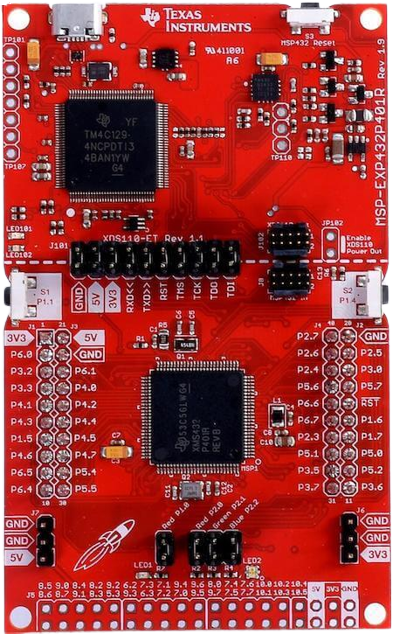

<!-- PROJECT LOGO -->
<br />
<div align="center">
  <a href="https://github.com/carlozamu/Fall_Detection_MSP432_and_ESP8266r">
    
  </a>

<h3 align="center">Fall Detection MSP432 and ESP8266</h3>

  <p align="center">
    Fall detection system using MSP432 microcontroller with Boosterpack and esp8266
    <br />
    <br /><br />
  </p>
</div>


# Requirements

## Software requirements

To use this project, you will need the following software:

* MSP432-specific version of the [MSPWare software](https://www.ti.com/tool/MSP432WARE#downloads)
* [Code Composer Studio](https://www.ti.com/tool/CCSTUDIO) Integrated Development Environment (IDE)
* Software developement kit for MSP432: [SIMPLELINK-MSP432-SDK](https://www.ti.com/tool/download/SIMPLELINK-MSP432-SDK/3.40.01.02)
<br> <br>

## Hardware Requirements
To use this project, you will need the following hardware:

* Texas Instruments MSP432P401R microcontroller
* [Educational BoosterPack MKII](https://www.ti.com/tool/BOOSTXL-EDUMKII)
* ESP8266 12E [used firmware: esp8266_nonos_sdk_v1.5.3_16_04_18_0]
  
<p float="left" align="center">
  
  
  
</p>

<br> <br>

## Project Layout

```
FallDetector/
├── main.c                    # Main application source file
├── Communications            # Communication module
│   ├── delay.c               # Delay functions
│   ├── delay.h
│   ├── esp8266.c             # ESP8266 Wi-Fi module functions
│   ├── esp8266.h
│   ├── telegram.c            # Telegram API functions
│   ├── telegram.h
│   ├── uartController.c      # UART communication functions
│   └── uartController.h
├── Game                      # Game logic
│   ├── game.c
│   └── game.h
├── Hardware                  # Hardware abstraction layer
│   ├── acc.c                 # Accelerometer functions
│   ├── acc.h
│   ├── alarm.c               # Alarm functions
│   ├── alarm.h
│   ├── HwInit.c              # Hardware initialization
│   └── HwInit.h
│   └── Sounds                # Sounds for the buzzer
│       ├── BuzzerSound.c
│       └── BuzzerSound.h
├── Images                    # Graphic assets and their definitions
│   ├── contextGraphic.h
│   ├── direction_graphics.c
│   ├── direction_graphics.h
│   ├── images.h
│   ├── images_definitions.h
│   └── Sample                # Sample images
│       ├── ambulance.png
│       ├── backward.png
│       ├── correct+mark+success+tick+valid+.png
│       ├── directions.png
│       ├── foreward.png
│       ├── left.png
│       ├── right.png
│       └── x.png
```

<!--=========================================================================-->
## Setting up the project
1. Import the project in Code Composer Studio
2. On the left side menu, right click on the project's name
3. Properties > Build > Arm Compiler > Include Options. Add the paths for simplelink_MSP432P4_SDK_3_4_0_01_02/source, simplelink_MSP432P4_SDK_3_4_0_01_02/source/third_party/CMSIS/Include
4. Properties > Arm Linker > File Search Path. Add the paths for simplelink_MSP432P4_SDK_3_4_0_01_02/source/third_party/CMSIS/DSP_Lib/lib/gcc/m4f/arm_cortexM4lf_math.a, simplelink_msp432p4_sdk_3_40_01_02/source/ti/devices/msp432p4xx/driverlib/ccs/msp432p4xx_driverlib.lib, simplelink_msp432p4_sdk_3_40_01_02/source/ti/grlib/lib/ccs/m4/grlib.a

## Setting up the hardware
1. Connect the MSP432 to the BoosterPack.
2. Connect the Rx/Tx of the MSP432 (pin 3.2 / 3.3) to the ESP8266's Tx/Rx. Make sure that the Rx and Tx pins are connected inversely.
3. Connect GND on both parts.
4. Connect the 3.3V pin of the MSP432 to the 3.3V pin on the ESP8266.
5. After ensuring all pins are well connected, connect the MSP432 to a power source.
6. Check that the display lights up white and the ESP8266 has a blue LED lit to confirm power is on. If all these conditions are met, then the connection was successful.

# Development of a Fall Detection System using the MSP432 Microcontroller
This innovative system is designed to enhance user safety through timely fall detection, drawing inspiration from the advanced capabilities of devices like the Apple Watch. By utilizing the MSP432 microcontroller, our system provides a suite of key features:

## 1. Advanced Fall Detection
Utilizing precise movement sensors, including a gyroscope and accelerometer, the system distinguishes falls from daily movements. This functionality allows it to trigger alarms only when strictly necessary, thus reducing false positives.

## 2. Multisensory Alarms
Upon detecting a fall, the device activates:

Auditory Alarms: A buzzer generates loud sounds to draw attention, helping quickly locate the user in distress.
Visual Notifications: Red and white flashes are displayed on the device's screen, enhancing visibility, especially in low-light conditions.
#3. Interactive Health-Check Mode
The system allows users to cancel alarms through an interactive interface requiring the completion of simple motor tasks. This ensures the user's ability to physically respond before deactivating the alarm, thereby confirming their safety status.

## 4. Emergency Call Management via Telegram Bot
If the user does not deactivate the alarm within a set timeframe, the system automatically sends an emergency message via a Telegram bot. This message communicates the situation to emergency services or pre-set contacts, ensuring an immediate and effective response to the emergency.
<br><br>
# Future Implementations
Looking ahead, we aim to expand and enhance our system's capabilities further by introducing new features:

## Operator Management System
A significant future enhancement will involve introducing a dedicated platform for emergency operators. This platform will allow for real-time monitoring of active emergencies, enabling operators to confirm interventions and manage emergency situations more effectively. Through an intuitive interface, operators will be able to view incident details and report the assistance provided, ensuring optimal management of emergencies.

These future enhancements are aimed at making our fall detection system not only more responsive and reliable but also better integrated with existing emergency services, ensuring faster and more targeted responses in emergency situations.

## Video and Presentation

- Youtube [video](https://youtu.be/lHRuercZcbo)
- Presentation [slides](https://docs.google.com/presentation/d/11FBGCgIohR_Q907LbEsJxZ_BNSmWm2RgmGfaZwzZ5zs/edit?usp=sharing)


# Team members 
- <strong> Carlo Zamuner</strong>,<strong> Edoardo Castagnini</strong>, <strong>Gianluigi Vazzoler</strong>, <strong>Valeria Mayora</strong>:<br>
  the work was carried out across the board by all members of the project, analyzing and expanding all the aspects of the project described above
